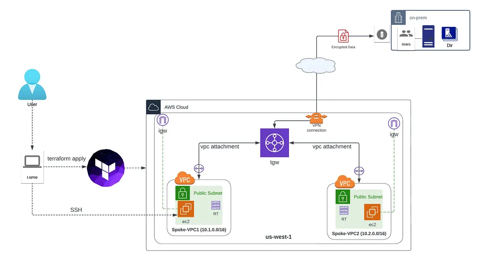
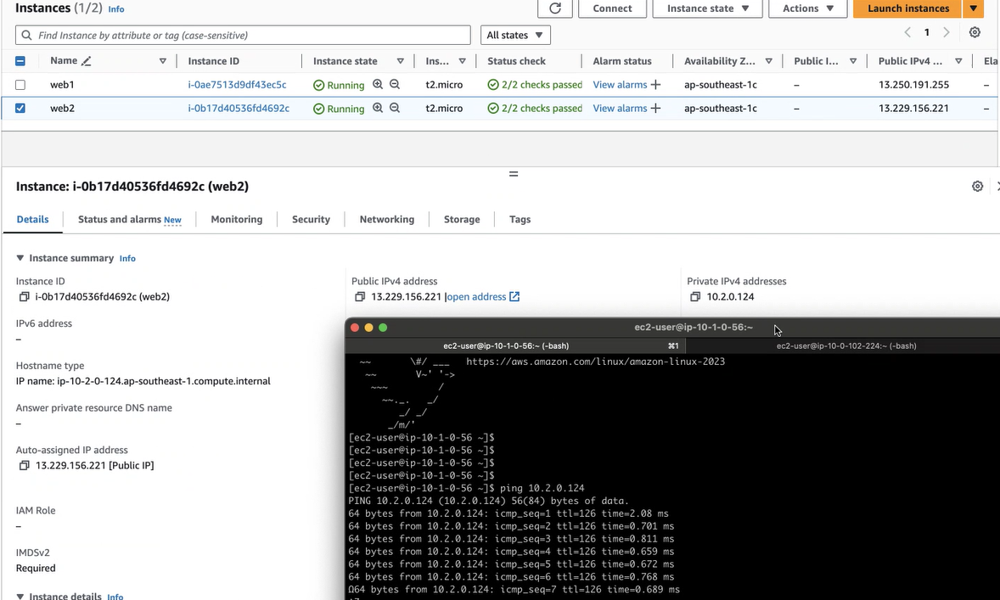

# STEP - 1. Generate the public key


1. Create public and private key follow below link.
2. https://docs.acquia.com/acquia-cloud-platform/manage-apps/command-line/ssh/getting-started/generate
3. Update the public in main.tf file.  

# STEP - 2. git clone the repo



## Verify the connectivity test

Can reach out to Web1 private IP from Web2
1. Can reach out to Web1 private IP from Web2




### Command to Deploy
```bash
  - terraform init
  - terraform validate
  - terraform fmt
  - terraform plan
  - terraform apply -auto-approve
  - terraform state list
```  
### Command to Undeploy  
```bash
  - terraform destroy -auto-approve
```  
